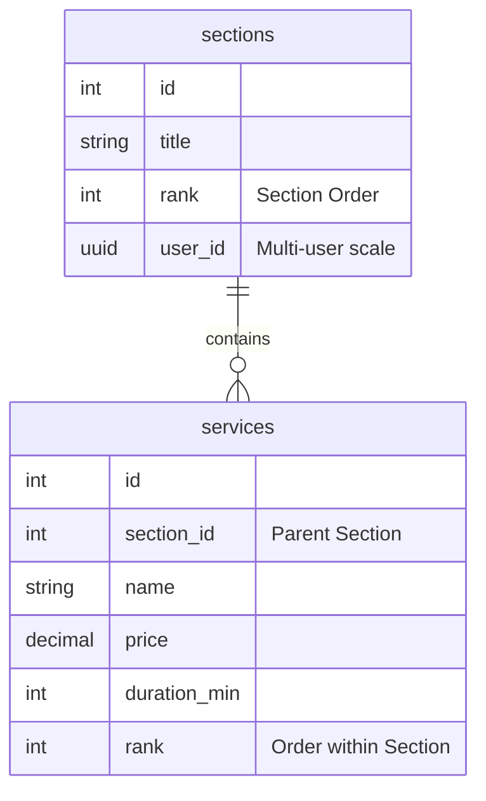

# Menu Manager

This is a menu manager made by Austin Hillyard in Next.js in about 2 hours. I haven't made a project in Next.js before so quite a bit of AI was used to setup and learn about Next.js and its functionality.

## Functionality

- Drag and Drop Services (Services stay within a section)
- Drag and Drop Sections

## Running it

First clone the repo

```bash
git clone [URL]
```

Then install npm packages

```bash
npm install
```

Finally run the project in dev mode

```bash
npm run dev
```

## Bugs

### Blinking Items on drag release

Whenever an item is released, it disappears briefly. I had another bug that would adjust the size of draggable items, but whenever I fixed this bug, the other reappeared.

I would like to have both bugs resolved, but I'm not super experienced with DnD functionality.

## Improvements

### Adding new items

Given new items in the data file they should render just fine once local storage is cleared. Essentially whenever an update from the database is received it should add it to local storage, and preserve the existing order by adding new items to the end.

# Database Schema

The database fields would be pretty similar to the data file I have, though the relationship is reversed. The services have a reference to the section they belong to, and both sections and services have a rank field that denotes the order it appears in.


